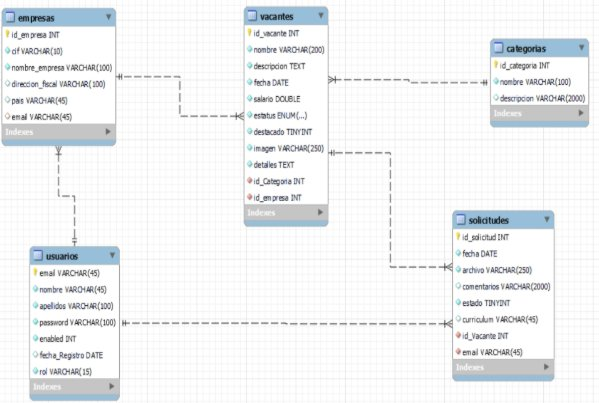

**Reto segundo DAW: Sistema de Gestión de Vacantes de Empleo y Solicitudes de Usuarios**

1. **Introducción**

El Sistema de Gestión de Vacantes de Empleo y Solicitudes de Usuarios es una aplicación web diseñada para simplificar y agilizar el proceso de contratación de personal para empresas y la búsqueda de empleo para los usuarios. Este sistema permite publicar vacantes de empleo y gestionar las solicitudes recibidas, mientras que los usuarios pueden buscar y postularse a las vacantes disponibles.

2. **Objetivos**

- Proporcionar a las empresas una plataforma para publicar, administrar y filtrar

vacantes de empleo.

- Facilitar a los usuarios la búsqueda de empleo mediante la visualización de

vacantes relevantes y la presentación de solicitudes en línea.

- Mejorar la experiencia del usuario ofreciendo una interfaz intuitiva y fácil de usar

tanto para empresas como para usuarios individuales.

3. **Modelo de base de datos**

4. **Funcionalidades Principales**
5. **Para la Empresa**:

- Publicación de Vacantes: La empresa puede publicar nuevas vacantes de empleo, incluyendo detalles como título del puesto, descripción del trabajo, requisitos y ubicación. El estado de la vacante será “CREADA”.
- Gestión de Vacantes: la empresa puede ver, editar o eliminar vacantes publicadas (el estado de la vacante será “CANCELADA”, y no se eliminará de la base de datos).
- Cuando una vacante se asigna a un candidato el estado quedará “ASIGNADA”, y la solicitud de este usuario se pondrá el estado a 1(adjudicada).
- Recepción de Solicitudes: La empresa puede ver y gestionar las solicitudes recibidas para cada vacante, incluyendo la capacidad de revisar currículums y enviar respuestas a los solicitantes (esto último es opcional).
- Modificación de los datos de su Empresa.

2. **Para el Administrador**

- Gestión de Empresas: Da de alta las Empresas que quieran publicar vacantes en nuestro sistema. Además de editar, ver detalles y eliminar.
- Para dar de alta una empresa nos tienen que proporcionar los datos de la Empresa(ver tabla Empresas), así como los datos del usuario(ver tabla usuarios). El usuario le daremos de alta asignando una password al azar (te inventas el algoritmo), y el rol “EMPRESA”.
- Gestión de Categorías: Crud de categorías.
- Gestión de Usuarios: posibilidad de dar de baja usuarios por mal uso del sistema(no se da de baja, se modifica la columna enabled a 0).
- Gestión de nuevos administradores: CRUD de usuarios con perfil “ADMON”.

3. **Para Usuarios:**

- Registro de Usuario: Los usuarios pueden registrarse en el sistema.
- Búsqueda de Empleo: Los usuarios pueden buscar vacantes de empleo utilizando filtros como empresas, tipo de contrato, categoría. Solo verán aquellas vacantes que están en estado “CREADA”.
- Postulación a Vacantes: Los usuarios pueden enviar solicitudes para las vacantes de empleo que les interesen, adjuntando su currículum, y en el campo detalles aspectos como : información personal, experiencia laboral y educación.
- Seguimiento de Solicitudes: Los usuarios pueden hacer un seguimiento del estado de sus solicitudes, ver si han sido revisadas o si han recibido alguna respuesta por parte de la empresa, con opción a cancelar la solicitud caso que no esté ya interesado.

5. **Tecnologías Utilizadas**

- **Para el front**: HTML, CSS, Bootstrap Javascript/Angular
- **Para el back**: servicio API REST con Spring Boot, y/o Nodejs/express)
- **Base de Datos**: en Mysql 8, y/o Mongodb
- **Autenticación y Autorización**:
- Sin Spring Security: cuando haces el login, montas un Json con email y password, lo recibimos y si es ok, te guardas el email, y en cada transmisión, mandas el email para que el back sepas quien eres.
- Con Spring Security y Guardas: Básica por usuario y contraseña.
- Con Spring Security y Guardas y JWT (JSON Web Tokens) para la autenticación
- **Despliegue**: Plataforma de alojamiento: Apache / Tomcat embutido en Spring

Boot, en archivo con extensión war y se deberá implementar toda la securización posible (https, ufw, ...)

- Los archivos se subirá por un servicio FTP que se instalará, gestionará en el

servidor. Además, se debe de incluir toda la securización sobre el servicio

- **Diseño de interfaces web**: trabajar UX/UI con Figma o similar para un diseño

optimo y con mejoras.

6. **Requisitos No Funcionales**

- Escalabilidad: Diseñar la aplicación para escalar fácilmente a medida que

aumenta la carga de usuarios y vacantes.

- Usabilidad: Garantizar una interfaz de usuario intuitiva y receptiva en todos los

dispositivos.

- Mantenibilidad: Seguir buenas prácticas de desarrollo de software y documentar

el código para facilitar el mantenimiento futuro.

- Rendimiento: Optimizar la aplicación para un rendimiento óptimo, minimizando

los tiempos de carga y respuesta.

7. **Diagrama de Arquitectura**

Dos aplicaciones independientes,

- el **frontend**, realizado en VisualStudioCode con ng server, y con llamadas HTTP

para interactuar con el Backend.

- el **backend** a través de una API RESTful son Spring Boot-JPA que proporcionará

endpoints para realizar operaciones CRUD en la base de datos.

- Un motor de Base de datos relacionales en MYSQL 8 / XAMP.
- Se debe de hacer un diagrama explicativo de todo el proceso de comunicación

por parte del cliente desde el navegador, dns (subdominios), servidor web (apache / tomcat), base de datos, securización. Se deberá incluir los métodos del servidor que se implemente (GET/POST/PUT..) y los códigos de respuesta posibles que puede devolver el servidor

8. **Entregables**

- Figma con el diseño de las vistas principales
- Código fuente del frontend en zip y en github
- Código fuente del frontend backend en zip y en github
- war de despliegue en consola de Windows 10/11/Linux, o desplegada en servidor dedicado
- Base de datos con script de creación e inserción de filas de las tablas /triggers a definir.
- Guía de despliegue y configuración en pdf
- Presentación de los puntos principales del reto en inglés (formato Pptx, canva, prezi o similar). Acompañar de audio explicativo en formato MP3 o MP4.
- EIE: Definir y justificar el modelo de negocio. Elaborar un análisis de costes, presupuesto inicial y estudio de mercado, incluyendo un análisis DAFO, estrategias de marketing y una propuesta comercial.\*\*
- Un mp4 con la explicación de todo el proyecto.\*\*

**ENTREGA INDIVIDUAL**

- Un cuestionario individual de cada uno: mis impresiones, y\*\*

**Fecha de entrega 9-Mayo.**

**Entrega en Aula Información DAW.**

**Cada profesor corregirá su parte en el aula correspondiente. 2 puntos por cada asignatura.**
